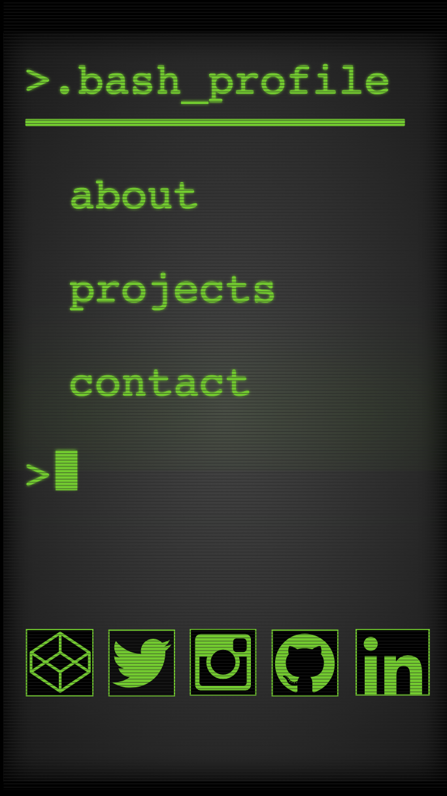
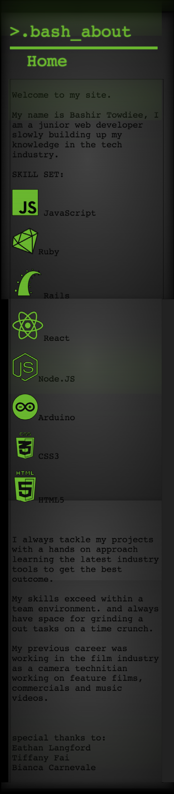
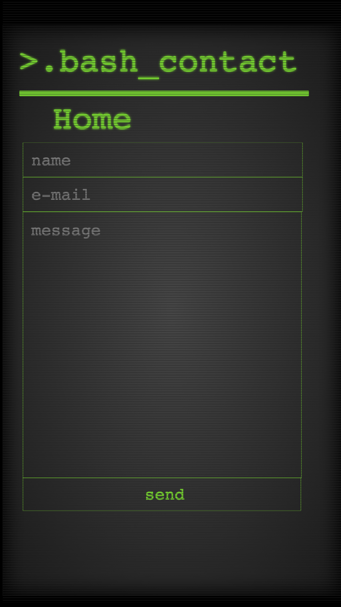
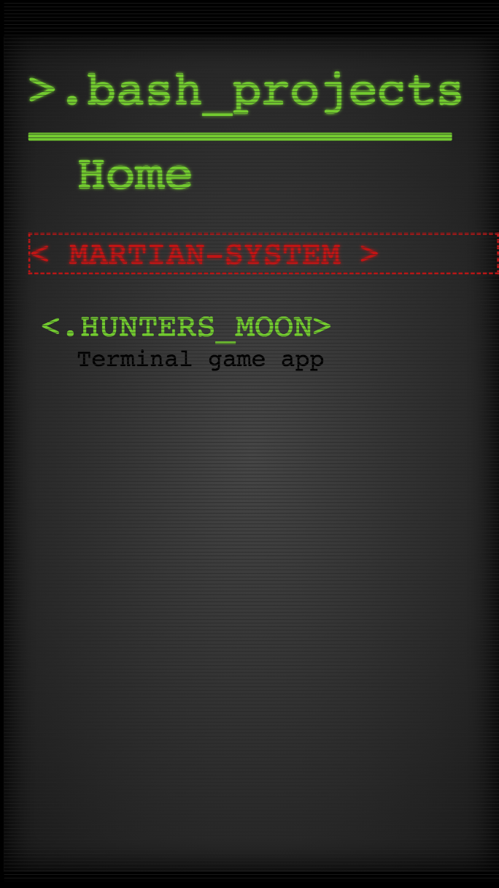
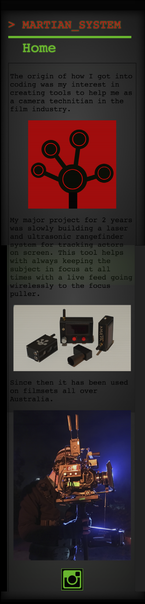
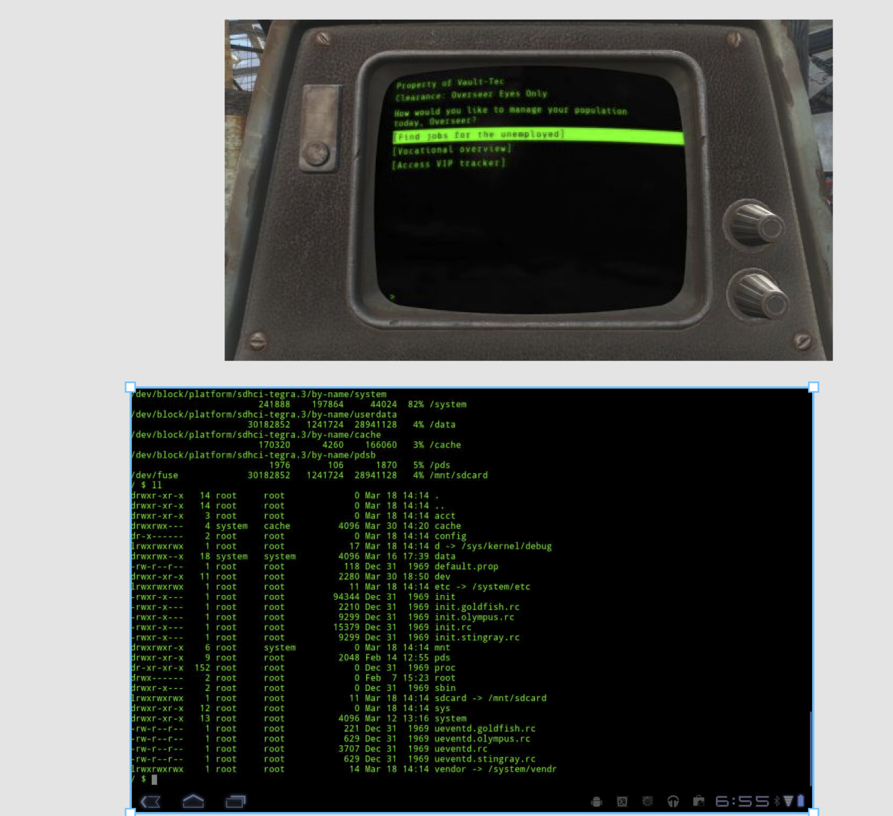
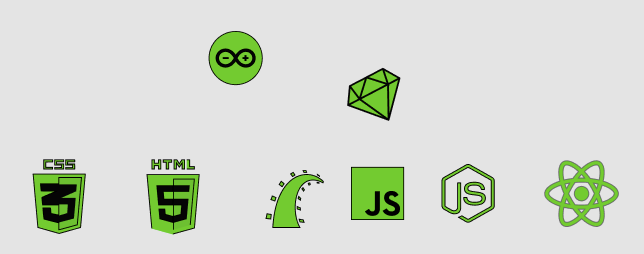
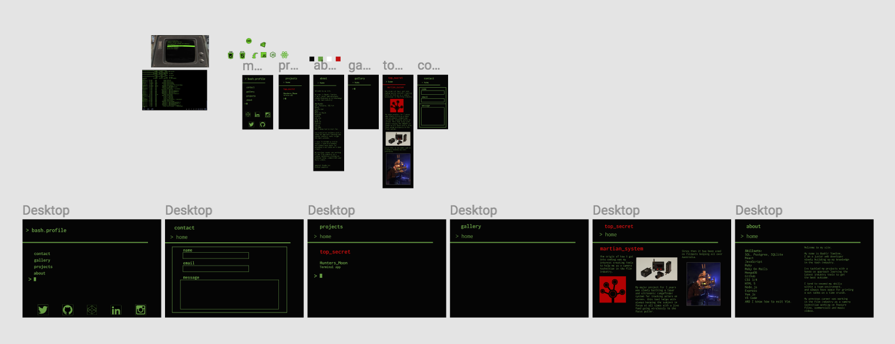

## website link: bashirtowdiee.netlify.com
Mobile version.

## A link to my GitHub repository
https://github.com/LicoriceRED/bashir_profile

## Description:

This website is designed to showcase my skills in web development. 

## Functionality / features:

multiple hover effects and scroll texture elements are used to add to the experience including the screen shutter scroll effect and the text pulsating in the paragraph section.  

Screenshots

## home page 

## about page

## contacts page

## projects page

## martian page

Target audience is for any future employers that finds my design skills interesting to implement in their projects.

Tech stack (e.g. html, css, deployment platform, etc)

Design documentation including,

## Design process

most of the inspiration came from the .bash_profile terminal idea. and its relations to my name Bashir.

## Design ideas
Got a few examples of terminals. one from the fallout videogame.

## Colors palette
that famous green text really hinted at me.

I used SVG for the icons and logos as I could easily change the colors to suit my design.

## Colored logos 

I completed my site in figma first before getting into the code. 

## mobile and desktop on figma

Usability considerations:
one of the main issues i was facing was the home button. as the page name might be misleading to be set to return to the home page. so on each page there is a designated home button at the top. 

### Details of planning process including,
Project plan & timeline

## A1

In the early 1960s US department of defence funded the created the Advanced Research Projects Agency Network, also known as ARPANET. It was used for packet switching on multiple computers in a network. In the 1970s the project continued to develop as Vinton Cerf and Robert Khan developed transmission control protocol and internet protocol. TCP/IP was used to lay the foundation in 1983 to assemble the network of networks. And that formed the modern internet. In the 1990 the online world became recognized after computer scientist Tim Berners-Lee invented the World Wide Web. WWW was the most common means to access data online using websites and hyperlinks.

## A2

Webs servers are computers set up in facilities called data centres and are operated by hosting companies. The purpose of these computers are to store websites. The files stored by webservers are read by browsers which convert these files into images and texts for you to view. Your browser communicates to the webservers to bring you information from the internet. Webservers can communicate with many browsers and many computers at the same time. The purpose is to serve files as requested. A server can send the same file or different file to different users at the same time. A domain is the address or location of a website e.g “google.com” which connect to the IP address using a DNS service that translated the name to its corresponding IP address.

## A3

One of the main way of accessing the internet today is from the use of Wifi that was invented in Australia in 1991 by John O’Sullivan, who was studying the weak radio waves that black holes produced. He used the same technique for a project with a company called CSIRO to send files wirelessly.

## Author 

Bashir Towdiee